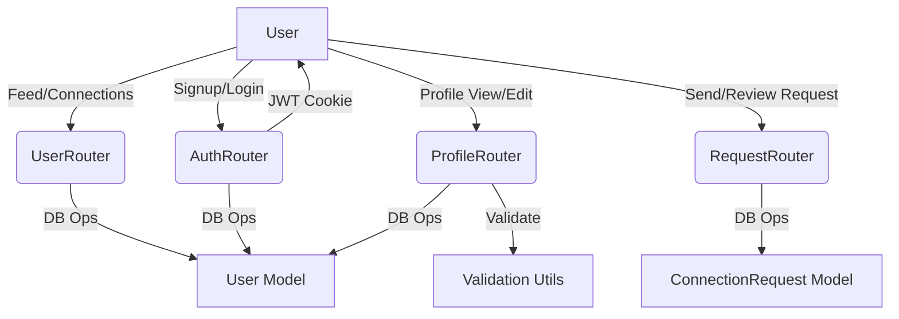

# DevTinder Backend


## Overview

DevTinder is a backend API for a developer matchmaking platform. It provides authentication, user profiles, connection requests, and feed APIs.

## Folder Structure

```
DevTinder-Backend/
  ├── src/
  │   ├── app.js
  │   ├── config/
  │   │   └── database.js
  │   ├── middlewares/
  │   │   └── auth.js
  │   ├── models/
  │   │   ├── connectionRequest.js
  │   │   └── user.js
  │   ├── routes/
  │   │   ├── authRouter.js
  │   │   ├── profileRouter.js
  │   │   ├── requestRouter.js
  │   │   └── userRouter.js
  │   └── utils/
  │       └── validation.js
  ├── package.json
  └── Readme.md
```

## API Flow



## Getting Started

1. Clone the repo  
   `git clone <repo-url>`
2. Install dependencies  
   `npm install`
3. Set up MongoDB connection in [`src/config/database.js`](DevTinder-Backend/src/config/database.js)
4. Start the server  
   `npm run dev`

## Main APIs

See [`src/ApiList.md`](DevTinder-Backend/src/ApiList.md) for full API documentation.

- **Auth:** `/signup`, `/login`, `/logout`
- **Profile:** `/profile/view`, `/profile/edit`, `/profile/password`
- **Connection Requests:** `/request/send/:status/:userId`, `/request/review/:status/:requestId`
- **User:** `/user/requests/received`, `/user/connections`, `/user/feed`

## License

ISC

---

Made with ❤️ by Aditya Bhatt