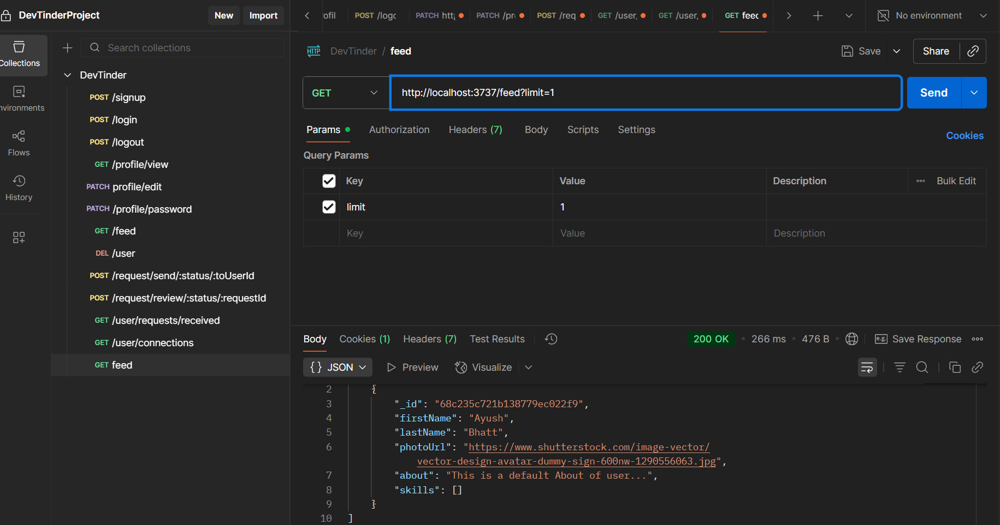

# 🌟 Lecture Notes: Feed API Logic & Pagination (Node.js Season 2 - Lecture 14)

## 📝 Key Concepts

* **Feed API** → API that gives the list of users you see in your app’s feed.
* **Filtering logic** → We don’t want to show:

  1. Users who are already connected with us (either `fromUserId` or `toUserId` in connection requests).
  2. The currently logged-in user.
* **Pagination** → Instead of sending thousands of users at once (which can overload DB and network), we break results into small chunks (pages).

✨ Think of it like Instagram feed → You don’t see all profiles at once, you scroll and get them page by page.

---

## 🔑 Steps in Feed API

1. **Get logged-in user** (`req.user`).
2. **Fetch connection requests**:

   * Find all requests where current user is either `fromUserId` or `toUserId`.
   * Select only those two fields.
3. **Build a hide list**:

   * Put all IDs from connection requests into a `Set` (avoids duplicates).
   * Convert `ObjectId` → `string` before adding.
4. **Query DB for feed users**:

   * Exclude IDs in `hideUsersFromFeed`.
   * Exclude current user ID.
5. **Pagination logic**:

   * `page = (query param) or 1`
   * `limit = (query param) or 10` (max 50 to avoid DB overload).
   * `skip = (page-1) * limit`.
6. **Send results back**.

---

## 📊 Pagination Flow

```
✨ Pagination Flow:
- 🧑 User calls `/feed?page=N&limit=M`
- ⚙️ Server calculates `skip=(page-1)*limit`
- 📂 DB fetches with `.skip().limit()`
- 📤 Response sent


```

✨ Extra Tip:
👉 Formula is always **`skip = (page-1)*limit`**.
Example:

* Page 1, limit 10 → skip 0 → get 1–10
* Page 2, limit 10 → skip 10 → get 11–20
* Page 3, limit 10 → skip 20 → get 21–30

---

## 🖼️ Lecture Slide / Board Screenshot


---

## 💻 Final Code with Pagination

```js
const USER_SAFE_DATA = "firstName lastName photoUrl age gender about skills";

// GET /feed API
userRouter.get("/feed", userAuth, async (req, res) => {
  try {
    const loggedInUser = req.user;

    // Pagination logic
    let page = parseInt(req.query.page) || 1;   // default page = 1
    let limit = parseInt(req.query.limit) || 10; // default limit = 10

    // Safety check: Max 50
    limit = limit > 50 ? 50 : limit;

    const skip = (page - 1) * limit; // Formula for skip

    // Get all connection requests related to logged-in user
    const connectionRequests = await ConnectionRequestModel.find({
      $or: [
        { fromUserId: loggedInUser._id },
        { toUserId: loggedInUser._id }
      ]
    }).select("fromUserId toUserId");

    // Prepare a set of userIds to hide from feed
    const hideUsersFromFeed = new Set();

    connectionRequests.forEach((req) => {
      hideUsersFromFeed.add(req.fromUserId.toString());
      hideUsersFromFeed.add(req.toUserId.toString());
    });

    // Fetch users for feed (not in hide list, not loggedInUser)
    const feedUsers = await User.find({
      $and: [
        { _id: { $nin: Array.from(hideUsersFromFeed) } },
        { _id: { $ne: loggedInUser._id } }
      ]
    })
      .select(USER_SAFE_DATA)
      .skip(skip)
      .limit(limit);

    res.send(feedUsers);
  } catch (err) {
    res.status(400).send("ERROR: " + err.message);
  }
});

module.exports = userRouter;
```

---

## 🌈 Recap

* ✅ Feed API excludes logged-in user and already connected users.
* ✅ Pagination is implemented using `.skip()` and `.limit()`.
* ✅ Safety limit max = 50 to protect DB.
* ✅ `skip = (page-1)*limit` formula is key.

✨ Mnemonic: **“Page minus one, times limit → that’s your skip.”**

